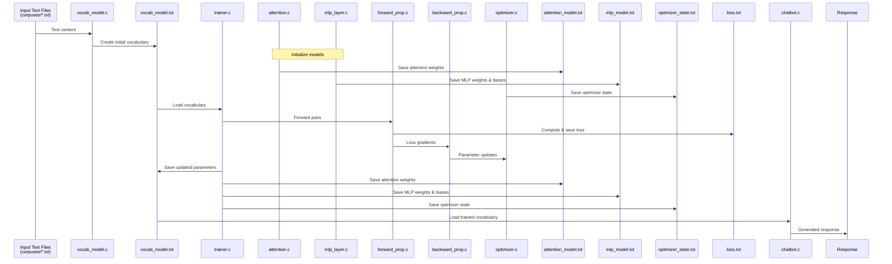

# Complete Pipeline Diagram

This diagram shows the complete flow of data through the chatbot pipeline, from text corpus creation to prediction output, including all modular neural network components and their interactions.

```mermaid
graph TD
    A[Input Text Corpus<br/>- Text files with words/emojis<br/>- e.g. test_emoji.txt] --> B[Vocabulary Creation]
    B --> C[vocab_model.txt]
    C --> D[Modular Training Process]
    D --> E[Updated vocab_model.txt]
    E --> F[Prediction Engine]
    F --> G[Generated Response]

    subgraph "1. Vocabulary Creation"
        A
        B[vocab_model.c<br/>- Tokenizes input text<br/>- Creates vocabulary entries<br/>- Initializes embeddings, weights, biases<br/>- Adds special tokens: start-token, end-token]
        C[vocab_model.txt<br/>- Contains:<br/>  • Word tokens<br/>  • Embeddings<br/>  • Positional encodings<br/>  • Weights<br/>  • Biases (bias1-bias4)]
    end

    subgraph "2. Modular Training"
        D[trainer.c<br/>- Orchestrates modular components<br/>- Implements full training loop<br/>- Uses Adam optimizer<br/>- Updates all model files]
        H[attention.c<br/>- Implements attention mechanism<br/>- Q, K, V transformations<br/>- Attention scoring]
        I[mlp_layer.c<br/>- Implements MLP layers<br/>  • Weight matrices<br/>  • Bias vectors<br/>  • ReLU activation]
        J[forward_prop.c<br/>- Forward pass through network<br/>- Combines attention + MLP<br/>- Loss computation]
        K[backward_prop.c<br/>- Backward pass<br/>- Gradient computation<br/>- Parameter updates]
        L[optimizer.c<br/>- SGD with momentum<br/>- Adam optimizer<br/>- Parameter updates]
        M[attention_model.txt<br/>- Attention weights<br/>- Q, K, V matrices]
        N[mlp_model.txt<br/>- MLP weights & biases<br/>- Hidden layer parameters]
        O[optimizer_state.txt<br/>- Optimizer parameters<br/>- Momentum, Adam states]
        P[loss.txt<br/>- Training loss history<br/>- Performance tracking]
        
        D -->|Uses| H
        D -->|Uses| I
        D -->|Uses| J
        D -->|Uses| K
        D -->|Uses| L
        H <--> M
        I <--> N
        L <--> O
        J --> P
        K --> P
    end

    subgraph "3. Prediction"
        F[chatbot.c<br/>- Loads vocab_model.txt<br/>- Processes user prompt<br/>- Predicts next words<br/>- Uses temperature sampling]
        G[Response Output<br/>- Generated text<br/>- Based on learned patterns]
    end

    style A fill:#e1f5fe
    style B fill:#f3e5f5
    style C fill:#fff3e0
    style D fill:#f3e5f5
    style E fill:#fff3e0
    style F fill:#f3e5f5
    style G fill:#e8f5e8
    style H fill:#bbdefb
    style I fill:#bbdefb
    style J fill:#bbdefb
    style K fill:#bbdefb
    style L fill:#bbdefb
    style M fill:#ffcdd2
    style N fill:#ffcdd2
    style O fill:#ffcdd2
    style P fill:#c8e6c9
```

## Detailed Pipeline Steps

### 1. Vocabulary Creation (`vocab_model.c`)
   - Reads input text files from `corpuses/` directory
   - Tokenizes words and emojis (handles UTF-8 properly)
   - Creates vocabulary entries with:
     - Word tokens (including special tokens like "start-token" and "end-token")
     - Random initial embeddings
     - Positional encodings (based on position in vocabulary)
     - Random initial weights
     - Zero-initialized biases (bias1-bias4)
   - Outputs `vocab_model.txt` with all vocabulary entries

### 2. Modular Training (`trainer.c` as orchestrator)
   - Loads `vocab_model.txt`
   - Calls separate executables to initialize neural network components:
     - Attention mechanism (`./+x/attention.+x init`) - creates `attention_model.txt`
     - MLP layers (`./+x/mlp_layer.+x init`) - creates `mlp_model.txt`
     - Optimizer (`./+x/optimizer.+x adam-init`) - creates `optimizer_state.txt`
   - For each training epoch:
     - Calls `./+x/forward_prop.+x` to perform forward propagation
     - Computes loss (simulated in current implementation)
     - Calls optimizer to update parameters
   - Saves updated parameters back to `vocab_model.txt`

### 3. Prediction (`chatbot.c`)
   - Loads trained `vocab_model.txt`
   - Processes user input prompt
   - For each prediction step:
     - Finds current word in vocabulary
     - Calculates dot product between current word vector and all vocabulary words
     - Applies softmax with temperature sampling
     - Selects next word from top candidates
     - Continues until "end-token" or length limit reached
   - Outputs generated response

## Data Flow Through Components



## Component Responsibilities

### Core Components
- **`vocab_model.c`**: Creates the initial vocabulary from text files
- **`trainer.c`**: Orchestrates the training process by calling separate component executables
- **`chatbot.c`**: Generates responses based on the trained model

### Neural Network Modules
- **`attention.c`**: Implements the attention mechanism with Q, K, V transformations
  - Operations: `init`, `forward`
- **`mlp_layer.c`**: Implements multi-layer perceptron with weights, biases, and ReLU activation
  - Operations: `init`, `forward`, `backward`
- **`forward_prop.c`**: Handles forward propagation through the network
  - Processes one word at a time through attention and MLP layers
- **`backward_prop.c`**: Handles backward propagation and gradient computation
  - Computes gradients for parameter updates
- **`optimizer.c`**: Implements optimization algorithms (SGD with momentum, Adam)
  - Operations: `sgd-init`, `adam-init`, `load`

### Model Files
- **`vocab_model.txt`**: Contains the vocabulary with all learned parameters
  - Updated by both `vocab_model.c` (initial) and `trainer.c` (training)
- **`attention_model.txt`**: Stores attention mechanism weights (Q, K, V matrices)
  - Created by `attention.+x` and managed by trainer.c during training
- **`mlp_model.txt`**: Stores MLP layer weights and biases
  - Created by `mlp_layer.+x` and managed by trainer.c during training
- **`optimizer_state.txt`**: Stores optimizer state (momentum, Adam parameters)
  - Created by `optimizer.+x` and managed by trainer.c during training
- **`loss.txt`**: Tracks training loss over time
  - Updated by `trainer.c` during training

## Usage Flow

1. **Setup**: 
   ```bash
   # Compile all modules
   cd +x
   bash xsath.compile-all.+x]🔘️.sh
   
   # Test modules
   ./test_modules.sh
   ```

2. **Training**:
   ```bash
   # Create vocabulary
   ./+x/vocab_model.+x corpuses/test_emoji.txt
   
   # Train model
   ./+x/trainer.+x vocab_model.txt
   ```

3. **Inference**:
   ```bash
   # Chat with bot
   ./+x/chatbot.+x vocab_model.txt "hello world"
   ```

## Key Features

- **Modular Architecture**: Each neural network component is a separate executable
- **File-based Communication**: Components communicate through model files
- **Emoji Support**: Properly handles UTF-8 emojis in text
- **Advanced Optimization**: Uses Adam optimizer for training
- **Temperature Sampling**: Variable randomness in text generation
- **Loss Tracking**: Monitors training progress through loss.txt

________________
heres the problem. the trainer  was supposed to be an                 │
│   orchestrator and  call the other files as executables, but i          │
│   dont see in code that ever happening, can u show me where             │
│   trainer calls those files?    
- **Special Tokens**: Uses start-token and end-token for sentence boundaries
