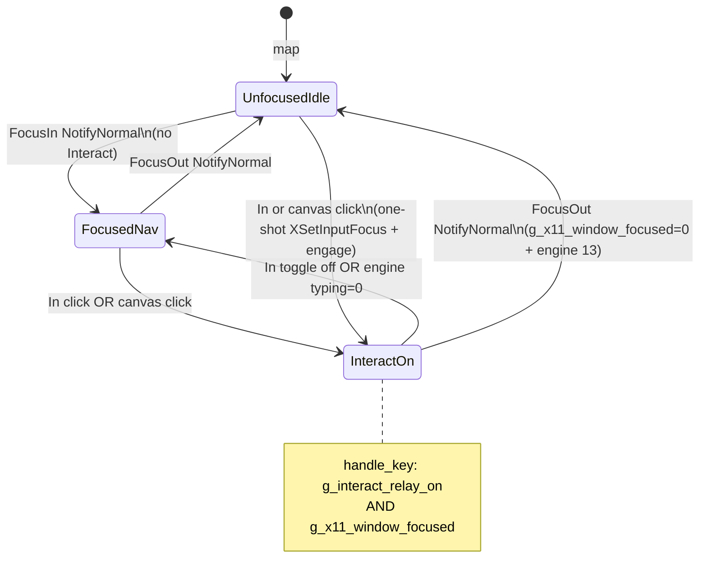
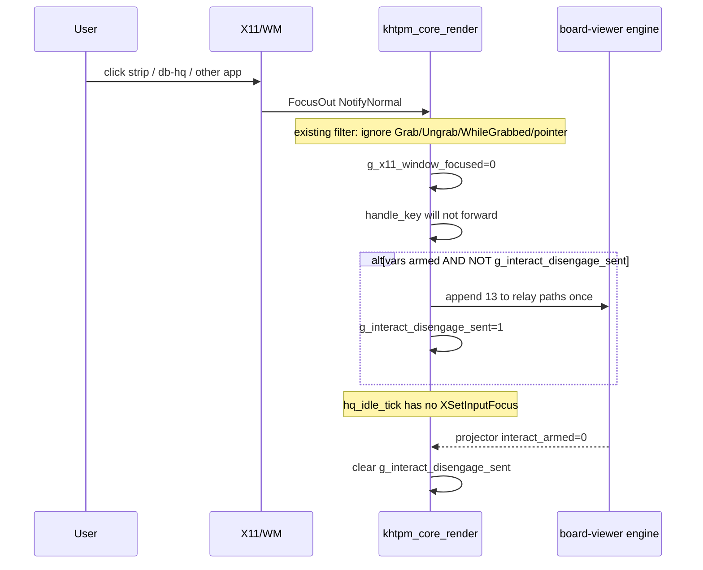
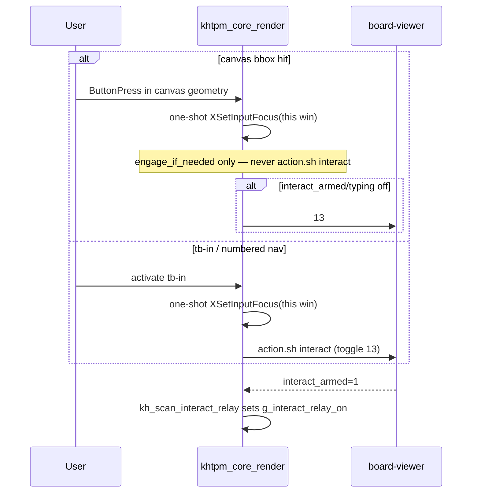

# pc-hq Interact: deactivate on real focus loss; re-engage from In or canvas click

| Field | Value |
|---|---|
| **Author** | grok (design only; no code in this task) |
| **Date** | 2026-09-08 |
| **Status** | Draft (rev 2 — review e352b8bc) |
| **House** | `44.xyz.01.00` |
| **Canonical copy** | `#.#.calendar-dox/!.HQ-IQ-BOOK/08-roadmap/design-docs/PC-HQ-FOCUS-AND-INTERACT-ACTIVATE.md` |
| **Prior art** | `09-appendix/pc-hq-leg-vs-nu-fix.md` (§2-B, §5-A/B, §6, §6c); commit `828b0cfe` (WM-managed + var-arm) |

---

## Overview

Interact Mode now arms and hardware keys can reach the WM-managed pc-hq board (class `managed`, var-arm in `kh_scan_interact_relay()`). The remaining defect is **focus hogging**: `hq_idle_tick()` (7745–7758) calls `XSetInputFocus` whenever the pointer is over the window and `XGetInputFocus` reports another client. Hover therefore steals keyboard focus back after the user has clicked strip, db-hq, or any other app.

The user wants two layers to stay in sync, without collapsing them:

- **A — X11 window focus:** who receives `KeyPress`.
- **B — Interact Mode:** `g_interact_relay_on` plus engine `active_gui_is_typing.txt`.

**Leave the window** (real `FocusOut` `NotifyNormal` only, not grab noise) → deactivate Interact (**engine `13` required**) **and** never steal focus from idle. **Click In** (toolbar / numbered nav) **or click the play screen** (`<canvas>` blit, not a play button) → one-shot `XSetInputFocus` **and** engage Interact. Mere `FocusIn` (alt-tab back, title click, chrome) must **not** auto-engage.

**Idle steal is deleted, not latched.** One-shot `XSetInputFocus` only on local `ButtonPress` (this window) and existing post-map retry. Never re-assert from `hq_idle_tick`, including never stealing from another client.

---

## Background & Motivation

### What landed (`828b0cfe` / §6c)

- `pchq-board.xhtpm`: `<window class="pchq-board-pal database-window managed">`.
- Window create **14430–14434**: `win_managed = dock_managed || elem_has_class(g_window, "managed")`; `g_win_managed_focus = win_managed && !dock_managed`. **Keep.** Do not revert to `override_redirect`. (14409-band is dock `override_redirect` comments, not this assignment.)
- `kh_scan_interact_relay()` 4424–4487: arms from projector vars `interact_class` / `interact_armed` / `bv_h1` every idle tick (does **not** consult X11 focus).
- Projector `pchq_board_projector.c`: publishes `interact_class` / `interact_armed` from `active_gui_is_typing.txt`.
- `pchq_board_action.sh`: verb `interact` (100–103) is unconditional `append_key 13` (**toggle**). `engage_if_needed` (73–80) exists for file/desk, **not** used by `interact`.
- There is **no** live `g_is_pchq` flag (comment only ~2011). Do not add one.

### The hog (`hq_idle_tick`, 7745–7758)

```c
if (g_win_managed_focus && dpy && win) {
    XGetInputFocus(dpy, &fw, &frev);
    if (fw != win) {
        if (XQueryPointer(...) && pointer is inside g_win_w/h)
            XSetInputFocus(dpy, win, RevertToParent, CurrentTime);
    }
}
```

This is a port of LEG §2-B `pchq_focus_ok`. LEG lived in a dedicated 810-line loop where that window *was* the game. NU shares the desktop. Pointer-over steal is the wrong invariant. **This block is deleted.**

### Related current code

| Site | Behavior |
|---|---|
| `handle_key()` 6884 | If `g_interact_relay_on`, **every** key including Escape is forwarded; local nav never runs. |
| FocusIn/FocusOut 8181–8199 | Title `^` / `.` only. Ignores `NotifyGrab` / `NotifyUngrab` / `NotifyWhileGrabbed` / pointer details. Does not touch Interact. |
| `g_focus_owned_painted` 1846, redraw 8219/8227 | **Paint** cache for `^`/`.`, not “we own focus now.” Do not overload as the Interact/focus gate. |
| Layout canvas 4861–4864 | Sizes `<canvas>`, sets `g_has_canvas`. **Does not** nav-number it. |
| `popup_handle_click` 7861–7888 | Hit-tests **`g_nav[i]` only**. Chrome/toolbar are in nav; `#view` is **not**. Template `action=` on canvas is a no-op until hit-test walks canvas bbox. |
| `nav_tab_poll_active()` ~7337 | Ledger raise of **this** window — **not** generic mouse. Do not cite as canvas/chrome focus. |
| Post-map `XSetInputFocus` ~14499 | Map-time retry. **Stays.** Not per-tick. |
| `tb-in` | `action=… pchq_board_action.sh … interact` (toggle), `relay=${bv_h1},${bv_h2}`. |

Pain: user clicks another window; pointer still over pc-hq → idle steal returns focus; Interact stays armed from vars; keys never reach the other app.

---

## Goals & Non-Goals

### Goals

1. **Deactivate on real window-focus loss.** Real `FocusOut` (`NotifyNormal` only, after existing grab filter) → `g_x11_window_focused=0` so `handle_key` does not forward; **required** engine `13` if vars say armed so `active_gui_is_typing.txt` matches; **never** idle `XSetInputFocus`.
2. **Activate / reactivate** only from:
   - **In** (`tb-in` click or numbered nav — existing `action.sh interact` **toggle**);
   - **Play screen** = click on `<canvas>` whose geometry is already laid out. **Engage-if-needed only** (never verb `interact` / never toggle-off).
3. **Local `ButtonPress` on this window** takes X11 focus once. **FocusIn alone does not engage Interact.**
4. Generic gates: `g_win_managed_focus` / `class="managed"` + page `relay=` item + `tag=="canvas"`. **No** `g_is_pchq`. This **is** the house Interact contract for any future managed+relay+canvas window (see Key Decision 5).
5. Keep WM-managed window (§5-A). Hog is §5-B steal.

### Non-Goals

- Revive `run_pchq_board_mode()` (~810 lines).
- Display-wide `XGrabKeyboard` (2026-09-04; §6).
- New layout branches / khtpm-house-standards violations.
- Auto-engage Interact on FocusIn / chrome-only click.
- Idle or latch re-assert of `XSetInputFocus`.
- `prisc+x` popen freeze — separate track.
- Hardware keyboard verification in this **design** task (required at implementation; XTest is not evidence).
- Widening FocusOut to `NotifyWhileGrabbed` in PR 2 (follow-up after hardware).

---

## Key Decisions

1. **Two flags only for key-forward.** `g_x11_window_focused` (FocusIn/Out after grab filter) is **not** `g_interact_relay_on` (projector var-arm). **`handle_key` gate is exactly** `g_interact_relay_on && g_x11_window_focused`. No `g_interact_relay_forward_ok`. Do not reuse `g_focus_owned_painted`.
2. **DELETE idle pointer-over `XSetInputFocus` entirely.** No `g_want_focus_assert`. One-shot `XSetInputFocus` only on local `ButtonPress` (this `win`) in `hq_dispatch_xevent` / `popup_handle_click` / chrome handlers, plus existing post-map. Idle must never steal from another client. Alt 3 (`None`/`PointerRoot` idle re-assert) is a **later optional**, still never steal from another client.
3. **FocusOut engine `13` is required** (PR 2), not optional. Renderer-local skip-forward alone leaves typing on; canvas `engage_if_needed` would then no-op. One-shot `g_interact_disengage_sent` debounce (see Observability).
4. **FocusIn does not engage.** Activate from In or play-screen click only.
5. **Canvas click is a generic C rule** (required hit-test; template `action=interact` is **forbidden**). Contract: `g_win_managed_focus` (or window `class="managed"`) **and** page has an `item` with `relay=` **and** click hits a `tag=="canvas"` bbox. **Any** future managed+relay+canvas app gets play-screen engage. Do **not** require `id="view"` unless a later app needs an opt-out class.
6. **No unbounded grab.** PR 4 only if hardware still flakes after PRs 1–3.
7. **Keep `class="managed"`** at 14430–14434.

---

## Proposed Design

### Truth table (implementer)

| `g_x11_window_focused` | `g_interact_relay_on` (vars) | `handle_key` | Idle `XSetInputFocus` |
|---|---|---|---|
| 0 | 0 | local nav (if keys even arrive) | **never** |
| 0 | 1 | **do not forward** (do not swallow for game) | **never** |
| 1 | 0 | local nav | **never** |
| 1 | 1 | forward + return (incl. Escape) | **never** |

### State machine (layers A and B)



### Sequence: click-away



### Sequence: re-engage



### Layer A — delete the steal

**`hq_idle_tick()` 7745–7758:** **delete** the entire `XQueryPointer` + `XSetInputFocus` block. Do not replace with a latch. Idle may still `XGetInputFocus` only if needed for some other reason; it **must not** call `XSetInputFocus`.

**One-shot take-focus:** on `ButtonPress` for this window, in `hq_dispatch_xevent` and/or `popup_handle_click` (7861–7888) and chrome handlers — `XSetInputFocus(dpy, win, RevertToParent, CurrentTime)` **once per click**, not per idle. Post-map retry ~14499 **stays**.

**Never** steal from another client from idle, latch, or hover.

### Layer B — Interact vs focus

**`kh_scan_interact_relay()` 4424–4487:** keep var-arm so the In badge tracks the engine. It may set `g_interact_relay_on` from vars even while unfocused (badge). **Forwarding is not this function’s job.**

**`handle_key()` 6884:** change the gate to:

```c
if (g_interact_relay_on && g_x11_window_focused) {
    /* existing remap + relay write + return */
}
```

If armed but unfocused, do **not** enter that block (local nav would also be wrong if keys are not for this window; typically no KeyPress arrives).

**FocusOut (after 8181–8199 filter, ~8223):** **only** `NotifyNormal` (filter already dropped Grab/Ungrab/WhileGrabbed and pointer details). Do **not** widen in PR 2.

```c
if (g_win_managed_focus) {
    g_x11_window_focused = 0;
    kh_interact_disengage_engine_if_on(); /* 13 once if armed; see debounce */
}
```

**FocusIn (~8202):** `g_x11_window_focused = 1`. Clear `g_interact_disengage_sent` so a later FocusOut can fire again. **Do not** engage / `13` / focus storm.

**Engine sync helper:** if `g_interact_relay_paths` / `bv_h1` known and `interact_armed`/`interact_class` say on, and `!g_interact_disengage_sent`, append `13\n` to relay paths (same write as `handle_key`, not a pchq shell, **not** `restore_interact` 2s sleeps). Set `g_interact_disengage_sent = 1`. Clear that flag when vars show off **or** on FocusIn. **Do not** write `active_gui_is_typing.txt` (engine-owned).

Stuck Interact after a menu (`NotifyWhileGrabbed` click-away) is a **follow-up**, not PR 2.

### Canvas / In activate

**In:** `action.sh interact` remains **toggle**. After PR 2 FocusOut `13`, In turns the engine on again. Numbered nav uses the same `action`. One-shot `XSetInputFocus` on that click.

**Canvas: FORBIDDEN** to set `action=` / `onclick=` to verb `interact` (would toggle **off** if already on). Do not ship a template-only PR.

**Required generic C (PR 3):**

1. On `ButtonPress`, **walk current page children** for `strcmp(tag,"canvas")==0` and test event coords against that Elem’s already-assigned `x,y,w,h` (layout 4861–4864). **Do not** rely on `g_nav` — canvas is not numbered.
2. If hit **and** (`g_win_managed_focus` or window `class="managed"`) **and** any page `item` has `relay[0]`:
   - one-shot `XSetInputFocus`;
   - **engage_if_needed:** write `13` only if projector/typing say **off**; if already on, **stay on**.
3. Implementation of engage: new `action.sh` verb `engage` that only calls `engage_if_needed`, **or** C writes `13` iff armed/typing is off. Prefer C using existing relay paths so canvas does not depend on shell. If a verb is added, **never** alias it to `interact`.
4. Toggle-off remains In / engine ESC / FocusOut `13`.

Chrome (`close`, `fullscreen`, `minimize`, File/Desk) is **not** interact-engage; it **does** one-shot X11 focus.

### Title indicator

Keep grab filter. `^` / `.` uses `g_focus_owned_painted` (paint only). Interact badge = projector `In: ON/off`.

---

## API / Interface Changes

No new public C API.

| Symbol | Role |
|---|---|
| `g_win_managed_focus` | unchanged create-time (14433–14434) |
| `g_x11_window_focused` | **new**; FocusIn=1 / FocusOut NotifyNormal=0 after grab filter |
| `g_interact_relay_on` | projector-driven (badge + half of `handle_key` gate) |
| `g_interact_disengage_sent` | **new** one-shot; set after FocusOut `13`; clear when `interact_armed=0` or FocusIn |
| `g_focus_owned_painted` | paint only; **not** a gate |
| ~~`g_want_focus_assert`~~ | **not used** |
| ~~`g_interact_relay_forward_ok`~~ | **not used** |

`pchq_board.xhtpm`: **no** `action=interact` on `#view`. Optional comment that canvas engage is renderer generic C.

Optional `pchq_board_action.sh` verb `engage` → `engage_if_needed` only if C does not write `13` itself.

---

## Data Model Changes

- FocusOut / canvas engage write `13` to existing `bv_h1` (`interact_relay.txt`); `bv_h2` optional same as today.
- **In** = toggle (`interact`). **Canvas** = engage-if-needed. Document in `pchq-board.xhtpm` toolbar comment.
- Projector unchanged (`interact_armed=0|1`).
- Do not truncate `active_gui_is_typing.txt` from the renderer.

---

## Alternatives Considered

### Alt 1 — Keep hover steal (status quo / LEG §2-B)

- **Pros:** LEG camera never lost keys while the pointer lingered.
- **Cons:** The hog. **Rejected.**

### Alt 2 — FocusOut-bounded `XGrabKeyboard`

- **Pros:** Keys while Interact on; §6 / cursword pattern.
- **Cons:** 2026-09-04 death if disarm fails. **Deferred to PR 4**, not default.

### Alt 3 — Idle steal only if `fw` is `None` / `PointerRoot`

- **Pros:** Recover after WM drops focus to root without fighting another client.
- **Cons:** Still idle `XSetInputFocus`; does not deactivate Interact. **Later optional only**; **never** steal from another client. **Not in PR 1.**

### Alt 4 — Auto-engage Interact on any FocusIn

- **Cons:** Contradicts In-or-play-screen. **Rejected.**

### Alt 5 — Delete steal + skip-forward only; no FocusOut `13`

- **Pros:** Cheaper; no toggle race; no `g_interact_disengage_sent`.
- **Cons:** Engine stays in typing. Canvas `engage_if_needed` then **does not** send `13`; user expected leave → deactivate. In/ESC would be required to match the typing file. **Rejected.** PR 2 is required for the stated loop.

### Alt 6 — Latch-gate idle steal (`g_want_focus_assert` until FocusOut)

- **Cons:** If FocusOut is delayed or filtered (`NotifyWhileGrabbed` ignored), idle steal **returns**. Contradicts “do not steal.” **Rejected.**

### Alt 7 — Template `action=interact` on canvas, zero C

- **Cons:** `popup_handle_click` never hits canvas (`g_nav` only); verb is toggle-off. **Rejected.**

---

## Security & Privacy Considerations

- No new network or credential surface.
- Relay writes remain append-only decimal codes under this window’s `bv_h1`.
- Removing idle steal **removes** key-sniff-via-focus-steal vs other clients.

---

## Observability

- Title `^` / `.` = layer A paint.
- `In: ON/off` = layer B.
- **Log only** FocusIn/Out (after filter) and the **deletion site** if someone reintroduces idle steal — **not** every `hq_idle_tick` (~30fps with `g_has_canvas`).
- Suggested line: `managed_focus=%d x11=%d relay_on=%d disengage_sent=%d fw=0x%lx`.
- **`g_interact_disengage_sent`:** set when FocusOut `13` is written; clear when vars `interact_armed`/class show off, or on FocusIn. Prevents double-toggle if two FocusOuts arrive before the projector flips. **Do not** copy `restore_interact` ~2s sleep loops into the renderer.

---

## Risks

| Severity | Risk | Mitigation |
|---|---|---|
| **High** | No idle steal → click-back without canvas/In does not route keys (old §3-B). | One-shot `XSetInputFocus` on **any** `ButtonPress` on this window (layer A) without engaging Interact. Then In/canvas for game keys. |
| **High** | FocusOut `13` double-toggle. | **Only** `NotifyNormal` after existing grab filter; `g_interact_disengage_sent`; send `13` only if vars say on. |
| **Med** | Click-away during grab delayed until `NotifyNormal`. | Follow-up after hardware; **not** PR 2 widening. Never Grab/Ungrab as Interact off. |
| **Med** | Canvas not in `g_nav`. | PR 3 **must** walk page children for canvas bbox. |
| **Low** | In toggle vs canvas engage-if-needed mix-up. | Forbid `interact` on canvas; C or verb `engage`. |
| **Low** | Generic contract hits a future managed+relay+canvas app. | Intended house Interact contract; opt-out class later if needed. |
| **Low** | Dock: `g_win_managed_focus` is false. | Strip unchanged. |

---

## Rollout Plan

1. **PR 1** — delete idle steal; `g_x11_window_focused`; `handle_key` gate; one-shot focus on ButtonPress. No engine `13` yet (forwarding stops; typing may still be on — incomplete user loop).
2. **PR 2 — required** — FocusOut `NotifyNormal` `13` + `g_interact_disengage_sent`. Completes “leave → deactivate.”
3. **PR 3** — canvas bbox hit-test + engage-if-needed. Depends on PR 1 and **PR 2** (not optional).
4. Relaunch pc-hq after renderer rebuild.
5. **Rollback:** revert steal-removal; **keep** `class="managed"`.
6. No feature flags / PDL.
7. Hardware pass after 1–3 **before** any grab (PR 4).
8. XTest/`xdotool` is not evidence (`pc-hq-leg-vs-nu-fix.md` §9).

---

## Verification (hardware vs relay)

### Relay / file (not “fixed”)

- FocusOut: `interact_relay.txt` gets `13` if typing was on; `interact_armed` → 0; `g_interact_disengage_sent` then clears.
- Canvas click while off: `13`; while on: **no** extra `13`.
- In click: toggle as today.
- `_NET_CLIENT_LIST` lists pc-hq; `xwininfo` Override Redirect = no.

### Real hardware (implementation)

| Step | Expected |
|---|---|
| Interact ON, arrows move camera | unchanged from `828b0cfe` |
| Click strip / db-hq / other app | those apps get keys; **no** hover steal |
| Engine typing / `In:` off | PR 2 |
| Click **title/chrome** only | `^`; Interact **stays off** |
| Click **canvas** | focus + Interact ON (or stay on) + arrows |
| Click **In** | toggle; after deactivate, In re-engages |
| Escape while engaged and focused | forwarded |

---

## Open Questions

1. Chrome click takes X11 focus without Interact? **Default: yes** (resolved).
2. Mutter click-away as `NotifyWhileGrabbed`? **Hardware follow-up; PR 2 stays NotifyNormal only.**
3. Canvas hit-test vs template? **Resolved: C bbox walk; no template `interact`.**
4. FocusOut retry if engine ignores `13`? **No renderer sleep.** One-shot + projector tick.

No blocking product questions remain for implementation of PRs 1–3.

---

## References

- `#.#.calendar-dox/!.HQ-IQ-BOOK/09-appendix/pc-hq-leg-vs-nu-fix.md` §2-B, §5-A/B, §6, §6c, §9
- `44.xyz.01.00/*.monads/*.livedesk-taskbar/ops/khtpm_core_render.c` — `g_win_managed_focus` 14430–14434; hog 7745–7758; `kh_scan_interact_relay` 4424–4487; `handle_key` 6884; FocusIn/Out 8181–8227; `popup_handle_click` 7861–7888; canvas layout 4861–4864; post-map ~14499
- `@.apps/piececraft-hq/pchq-board.xhtpm`, `ops/pchq_board_projector.c`, `ops/pchq_board_action.sh` (`interact` 100–103, `engage_if_needed` 73–80)
- `03-pitfalls/X11-AND-SESSION-PITFALLS.md`
- `CENTROID_GOLD_STD.md` / khtpm-house-standards

---

## PR Plan

### PR 1 — Delete idle focus steal; track real X11 focus

- **Title:** `fix(khtpm): delete idle pointer-over XSetInputFocus on managed windows`
- **Files:** `44.xyz.01.00/*.monads/*.livedesk-taskbar/ops/khtpm_core_render.c`
- **Depends on:** none (`828b0cfe` already landed)
- **Changes:** **Delete** `hq_idle_tick` 7745–7758 `XQueryPointer`/`XSetInputFocus` (no latch). `g_x11_window_focused` on FocusIn/Out after existing grab filter. One-shot `XSetInputFocus` on local `ButtonPress` in `hq_dispatch_xevent` / `popup_handle_click` / chrome — **not** `nav_tab_poll_active` 7337. `handle_key`: `g_interact_relay_on && g_x11_window_focused`. Keep `class="managed"` 14430–14434. Keep post-map ~14499.

### PR 2 — FocusOut disengages engine Interact (`13`) — **required**

- **Title:** `fix(khtpm): FocusOut NotifyNormal sends interact-off 13 when relay armed`
- **Files:** `khtpm_core_render.c` (helper next to `kh_scan_interact_relay`)
- **Depends on:** PR 1
- **Changes:** After existing 8181–8199 filter, **only** `NotifyNormal`: if `g_win_managed_focus` and vars armed and `!g_interact_disengage_sent`, append `13` once. Clear flag when vars off or FocusIn. No grab. No typing-file clobber. No `NotifyWhileGrabbed` widening.

### PR 3 — Canvas bbox engage-if-needed; In unchanged

- **Title:** `fix(khtpm): canvas click engage-if-needed for managed+relay windows`
- **Files:** `khtpm_core_render.c` (mouse path); optional `pchq_board_action.sh` verb `engage`; `pchq-board.xhtpm` comment only (**no** `action=interact` on canvas)
- **Depends on:** PR 1 **and PR 2** (required — otherwise canvas sees typing still on)
- **Changes:** Walk page children for `tag==canvas` bbox (not `g_nav`). If managed+relay: one-shot focus + `13` iff engine off. House contract for managed+relay+canvas. `tb-in` stays toggle. No `g_is_pchq`. No `run_pchq_board_mode`.

### PR 4 (optional, hardware flake only)

- **Title:** `fix(khtpm): FocusOut-bounded keyboard grab for managed+relay windows`
- **Files:** `khtpm_core_render.c` only
- **Depends on:** PRs 1–3 proven insufficient on **real** keyboard
- **Changes:** Grab while Interact **and** focused; ungrab on real FocusOut. Not unbounded. Contingency.
